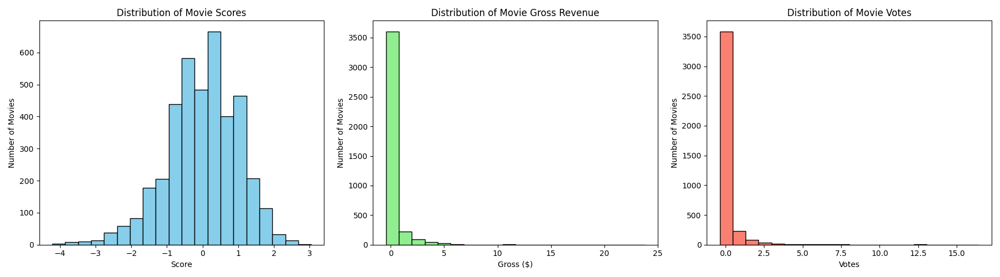
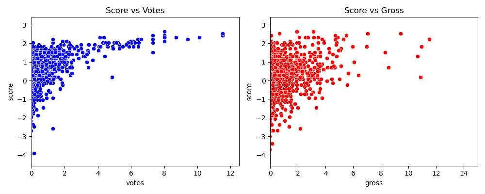
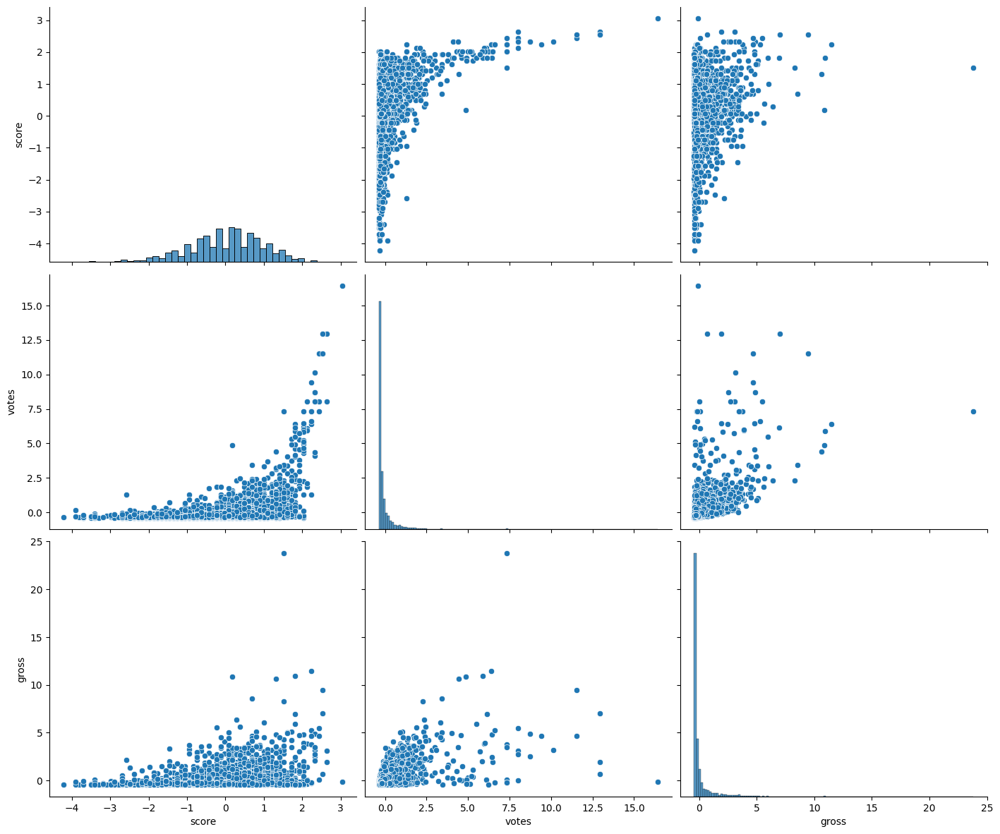
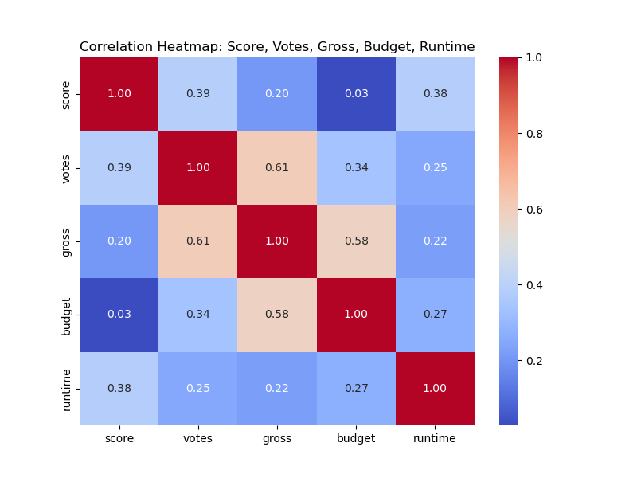
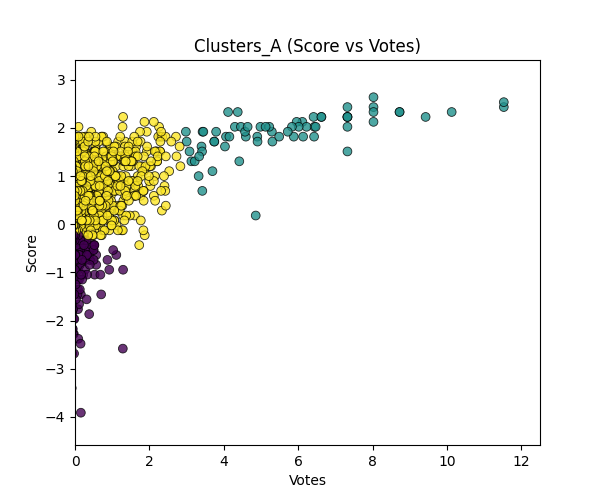
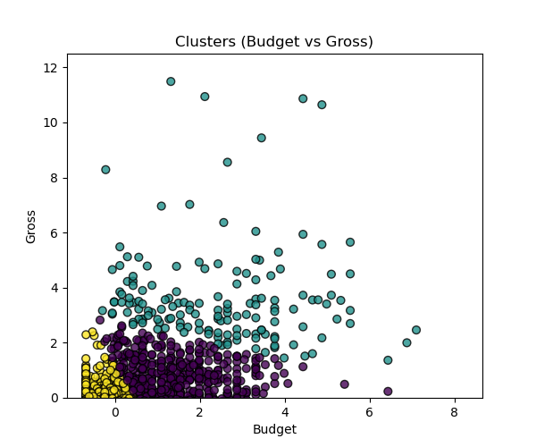
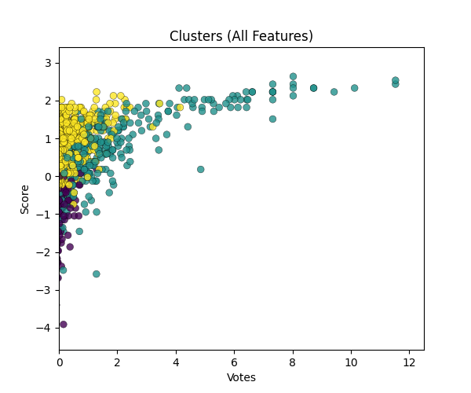

# 🎬 Movie Analytics Pipeline

**Big Data Assignment**

| | |
|---|---|
| **Names** | Nada Ibrahim Elghaweet · Mazen Ayman · Youssef Ibrahim |
| **IDs** | 231000941 · 231000718 · 231000834 |
| **GitHub** | [Nada-Elghaweet/big-data-movie-pipeline](https://github.com/Nada-Elghaweet/big-data-movie-pipeline) |
| **Docker Hub** | [nada2341/big_data_3](https://hub.docker.com/r/nada2341/big_data_3) |

---

## Table of Contents

1. [Project Overview](#1-project-overview)
2. [Directory Structure](#2-directory-structure)
3. [Pipeline Architecture](#3-pipeline-architecture)
4. [Components](#4-components)
   - [ingest.py](#41-ingestpy--data-ingestion)
   - [preprocess.py](#42-preprocesspy--data-preprocessing)
   - [analytics.py](#43-analyticspy--analytics--insights)
   - [visualize.py](#44-visualizepy--visualization)
   - [cluster.py](#45-clusterpy--clustering-analysis)
   - [summary.sh](#46-summarysh--pipeline-orchestrator)
5. [Docker Setup & Commands](#5-docker-setup--commands)
6. [Running the Pipeline](#6-running-the-pipeline)
7. [Execution Flow](#7-execution-flow)
8. [Sample Outputs](#8-sample-outputs)
9. [Outputs Reference](#9-outputs-reference)
10. [Dependencies](#10-dependencies)
11. [Notes](#11-notes)

---

## 1. Project Overview

This project builds a reproducible, containerized data science pipeline that processes a raw movies dataset through five sequential stages: **ingestion → preprocessing → analytics → visualization → clustering**. Each stage is a self-contained Python script, and the entire pipeline is orchestrated by `summary.sh`, which spins up a Docker container, runs all scripts inside it, and copies results back to the host machine automatically.

**Key goals:**
- Clean and transform messy movie data into an analysis-ready format
- Extract meaningful insights about genres, countries, and revenue
- Produce visualizations that reveal distributions and relationships in the data
- Apply unsupervised machine learning (KMeans) to discover natural movie groupings

---

## 2. Directory Structure

```
Big_Data_Assignment/
├── ingest.py                  # Stage 1: Data ingestion
├── preprocess.py              # Stage 2: Data preprocessing
├── analytics.py               # Stage 3: Insights extraction
├── visualize.py               # Stage 4: Visualization
├── cluster.py                 # Stage 5: Clustering analysis
├── summary.sh                 # Pipeline orchestrator
├── Dockerfile                 # Container definition
├── movies_updated.csv         # Raw input dataset
│
└── results/                   # Auto-created after running summary.sh
    ├── data_raw.csv
    ├── data_preprocessed.csv
    ├── insight1.txt
    ├── insight2.txt
    ├── insight3.txt
    ├── summary_histograms.png
    ├── summary_scatter.png
    ├── summary_pairplot.png
    ├── summary_heatmap.png
    ├── clusters_A_plot.png
    ├── clusters_B.png
    ├── clusters_C.png
    └── clusters.txt
```

---

## 3. Pipeline Architecture

`summary.sh` builds and runs the container, executes all scripts inside it, then copies every output to `./results/` on the host.

```
movies_updated.csv
        |
        v
   [ ingest.py ]  ──────────────────────────► data_raw.csv
        |
        v
[ preprocess.py ] ─────────────────────────► data_preprocessed.csv
        |
        |─────────────────┬─────────────────┐
        v                 v                 v
[ analytics.py ]  [ visualize.py ]  [ cluster.py ]
        |                 |                 |
        v                 v                 v
  insight1-3.txt    summary*.png    clusters*.png + clusters.txt
        |                 |                 |
        └─────────────────┴─────────────────┘
                          |
                          v
              docker cp → ./results/
```

---

## 4. Components

### 4.1 `ingest.py` — Data Ingestion

**Purpose:** Loads the raw CSV dataset, prints a summary, and saves it as `data_raw.csv`.

**What it does:**
- Accepts the dataset path as a command-line argument
- Reads the CSV using `pandas` and prints shape + first 5 rows
- Saves the data as `data_raw.csv` for downstream stages

**Output:** `results/data_raw.csv`

---

### 4.2 `preprocess.py` — Data Preprocessing

**Purpose:** Cleans, transforms, and scales the raw data into a format suitable for analysis and machine learning.

#### Data Cleaning
- Splits `released` into `release_date` and `release_country`; drops `released` and the redundant `year` column
- Converts `release_date` to datetime (`errors='coerce'`)
- Fills missing categorical values (`rating`, `writer`, `star`, `company`, `release_country`, `release_date`) with the **mode**
- Fills missing `gross` values with the **median** (11,838,218.0)
- Checks for and reports duplicate rows (none found)

#### Feature Transformation
- Label-encodes categorical columns: `rating`, `genre`, `country`, `director`, `writer`, `star`, `company`, `release_country`
- Fixes the malformed `runtime,,` column — strips commas, casts to float, renames to `runtime`
- Standard-scales numerical columns: `budget`, `gross`, `score`, `votes`, `runtime`

#### Dimensionality Reduction
- Selects relevant columns: `rating`, `genre`, `score`, `votes`, `budget`, `gross`, `runtime`, `release_country`, `release_date`
- Discretizes `score` into 3 quantile bins: `Low`→0, `Medium`→1, `High`→2 (stored as `score_bin`)

**Input:** `data_raw.csv` → **Output:** `results/data_preprocessed.csv`

---

### 4.3 `analytics.py` — Analytics & Insights

**Purpose:** Derives three key insights from the preprocessed data and saves them as text files.

| Insight | Question | Output File |
|---------|----------|-------------|
| Insight 1 | What are the top 3 genres by average score? | `insight1.txt` |
| Insight 2 | Which country has the highest average movie score? | `insight2.txt` |
| Insight 3 | Which rating has the highest average gross revenue? | `insight3.txt` |

> **Note:** Values are label-encoded integers since encoding happens in `preprocess.py` before this stage runs.

**Input:** `data_preprocessed.csv` → **Output:** `results/insight1.txt`, `insight2.txt`, `insight3.txt`

---

### 4.4 `visualize.py` — Visualization

**Purpose:** Generates plots to explore distributions, relationships, and correlations in the data.

| Plot | File | Description |
|------|------|-------------|
| Histograms | `summary_histograms.png` | Score, gross revenue, and votes distributions |
| Scatterplots | `summary_scatter.png` | Score vs Votes and Score vs Gross |
| Pairplot | `summary_pairplot.png` | Pairwise relationships between score, votes, gross |
| Heatmap | `summary_heatmap.png` | Pearson correlation matrix for numeric features |

**Input:** `data_preprocessed.csv` → **Output:** `results/summary_histograms.png`, `summary_scatter.png`, `summary_pairplot.png`, `summary_heatmap.png`

---

### 4.5 `cluster.py` — Clustering Analysis

**Purpose:** Applies KMeans (k=3) on three feature subsets to reveal natural movie groupings.

| Cluster Set | Features Used | Output File |
|-------------|--------------|-------------|
| Cluster A | `score`, `votes` | `clusters_A_plot.png` |
| Cluster B | `budget`, `gross` | `clusters_B.png` |
| Cluster C | `score`, `votes`, `gross`, `budget`, `runtime` | `clusters_C.png` |

**Cluster labels:**

| Cluster | A (Score/Votes) | B (Budget/Gross) | C (All Features) |
|---------|----------------|-----------------|-----------------|
| 0 | Popular & high-rated | High budget & high gross | High across all features |
| 1 | Unpopular & low-rated | Low budget & low gross | Low across all features |
| 2 | Mixed / average | Medium performance | Average / mixed |

> **Note:** Cluster C is 5-dimensional; its plot uses Score vs Votes axes for 2D visualization.

**Input:** `data_preprocessed.csv` → **Output:** `results/clusters_A_plot.png`, `clusters_B.png`, `clusters_C.png`, `clusters.txt`

---

### 4.6 `summary.sh` — Pipeline Orchestrator

**Purpose:** Runs the entire pipeline end-to-end with a single command from the host machine.

**What it does:**
1. Starts a container named `big_data_movies_containerr` from the `big_data_movies` image
2. Runs all 5 Python scripts sequentially inside the container
3. Creates a `results/` folder on the host
4. Copies all output files from the container to `./results/`
5. Stops and removes the container

---

## 5. Docker Setup & Commands

### Build the Image

```bash
docker build -t big_data_movies .
```

### Tag for Docker Hub

```bash
docker tag big_data_movies nada2341/big_data_movies:latest
```

### Push to Docker Hub

```bash
docker push nada2341/big_data_movies:latest
```

### Pull from Docker Hub (on any machine)

```bash
docker pull nada2341/big_data_movies:latest
```

> Image available at: [hub.docker.com/r/nada2341/big_data_movies](https://hub.docker.com/r/nada2341/big_data_movies)

---

## 6. Running the Pipeline

The pipeline runs entirely from the **host machine** — no need to enter the container manually:

```bash
bash summary.sh
```

This will:
1. Spin up the Docker container
2. Execute all 5 scripts inside it
3. Copy all results to `./results/` on your machine
4. Clean up the container automatically

> **Prerequisite:** The Docker image must be built first (`docker build -t big_data_movies .`) or pulled from Docker Hub.

---

## 7. Execution Flow

```
Loaded dataset with 4000 rows and 15 columns.

dataset shape: (4000, 15)
Here's the first 5 rows:
                                             name  ... runtime,,
0                                     The Shining  ...    146.0,
1                                 The Blue Lagoon  ...    104.0,
2  Star Wars: Episode V - The Empire Strikes Back  ...    124.0,
3                                       Airplane!  ...     88.0,
4                                      Caddyshack  ...     98.0,

Saved raw data as data_raw.csv
Dataset shape: (4000, 15)

Missing values per column:
 rating              40
 writer               1
 star                 1
 gross              169
 company             10
 release_date        53

Filled missing values in 'rating' with mode: R
Filled missing values in 'writer' with mode: Stephen King
Filled missing values in 'star' with mode: Robert De Niro
Filled missing values in 'company' with mode: Paramount Pictures
Filled missing values in 'release_country' with mode: United States
Filled missing values in 'release_date' with mode: 1986-02-14 00:00:00
Filled missing values in 'gross' with median: 11838218.0

Encoded column 'rating'
Encoded column 'genre'
Encoded column 'country'
Encoded column 'director'
Encoded column 'writer'
Encoded column 'star'
Encoded column 'company'
Encoded column 'release_country'

Scaled numerical columns: ['budget', 'gross', 'score', 'votes', 'runtime']
Saved preprocessed data as data_preprocessed.csv

Insight 1: Top 3 genres by average score:
1. 9: 2.02
2. 11: 0.90
3. 3: 0.75

Insight 2: Movies from 7 have the highest average score of 1.82.
Insight 3: Movies with rating '1' have the highest average gross revenue of $1.

clusters.txt created

Pipeline finished! All results are now in ./results/
```

---

## 8. Sample Outputs

### Insight 1 — Top 3 Genres by Average Score

```
Insight 1: Top 3 genres by average score:
1. 9: 2.02
2. 11: 0.90
3. 3: 0.75
```

### Insight 2 — Country with Highest Average Score

```
Insight 2: Movies from 7 have the highest average score of 1.82.
```

### Insight 3 — Rating with Highest Gross Revenue

```
Insight 3: Movies with rating '1' have the highest average gross revenue of $1.
```

### Cluster Summary

```
cluster_A (Score vs Votes):
Number of movies in each cluster:
Cluster 0 (popular & high rated): 1604 movies
Cluster 1 (unpopular & low rated): 70 movies
Cluster 2 (mixed / average): 2326 movies

cluster_B (Budget vs Gross):
Number of movies in each cluster:
Cluster 0 (high budget & gross): 671 movies
Cluster 1 (low budget & gross): 154 movies
Cluster 2 (medium performance): 3175 movies

cluster_C (All Features):
Number of movies in each cluster:
Cluster 0 (high score & votes & gross & budget & runtime): 1874 movies
Cluster 1 (low everything): 287 movies
Cluster 2 (average/mixed): 1839 movies
```

---

### Visualizations

#### Distribution Histograms


#### Score vs Votes & Score vs Gross


#### Pairplot — Score, Votes, Gross


#### Correlation Heatmap


#### Cluster A — Score vs Votes


#### Cluster B — Budget vs Gross


#### Cluster C — All Features (5D → 2D)


---

## 9. Outputs Reference

| File | Type | Generated By | Description |
|------|------|-------------|-------------|
| `data_raw.csv` | CSV | `ingest.py` | Raw dataset (4000 rows, 15 columns) |
| `data_preprocessed.csv` | CSV | `preprocess.py` | Cleaned, encoded, and scaled dataset |
| `insight1.txt` | Text | `analytics.py` | Top 3 genres by average score |
| `insight2.txt` | Text | `analytics.py` | Country with highest average score |
| `insight3.txt` | Text | `analytics.py` | Rating with highest gross revenue |
| `summary_histograms.png` | PNG | `visualize.py` | Score, gross, votes distributions |
| `summary_scatter.png` | PNG | `visualize.py` | Score vs Votes & Score vs Gross |
| `summary_pairplot.png` | PNG | `visualize.py` | Pairplot of score, votes, gross |
| `summary_heatmap.png` | PNG | `visualize.py` | Correlation heatmap |
| `clusters_A_plot.png` | PNG | `cluster.py` | KMeans: Score vs Votes clusters |
| `clusters_B.png` | PNG | `cluster.py` | KMeans: Budget vs Gross clusters |
| `clusters_C.png` | PNG | `cluster.py` | KMeans: All-features clusters (5D→2D) |
| `clusters.txt` | Text | `cluster.py` | Cluster sizes and labels summary |

---

## 10. Dependencies

| Package | Purpose |
|---------|---------|
| `pandas` | Data loading and manipulation |
| `numpy` | Numerical operations |
| `matplotlib` | Plot rendering |
| `seaborn` | Statistical visualizations |
| `scikit-learn` | Label encoding, scaling, KMeans |
| `scipy` | Supporting scientific computations |
| `jupyter` | Included in image for optional notebook use |

All installed automatically via the `Dockerfile`.

---

## 11. Notes

- The pipeline runs **entirely from the host** via `bash summary.sh` — no need to enter the container manually.
- `set -e` in `summary.sh` ensures the pipeline **stops immediately** if any script fails.
- KMeans uses `random_state=42` in all clustering runs for reproducible results.
- `release_date` parsing uses `errors='coerce'` — unparseable dates become `NaT` and are filled with the mode (`1986-02-14`).
- Insights report label-encoded integers because encoding happens in `preprocess.py` before `analytics.py` runs. Original labels can be recovered using the `label_encoders` dictionary in `preprocess.py`.
- `clusters_A` saves as `clusters_A_plot.png` — this matches the `docker cp` command in `summary.sh`.
- Docker image: [nada2341/big_data_movies](https://hub.docker.com/r/nada2341/big_data_movies)
- GitHub repo: [Nada-Elghaweet/big-data-movie-pipeline](https://github.com/Nada-Elghaweet/big-data-movie-pipeline)
